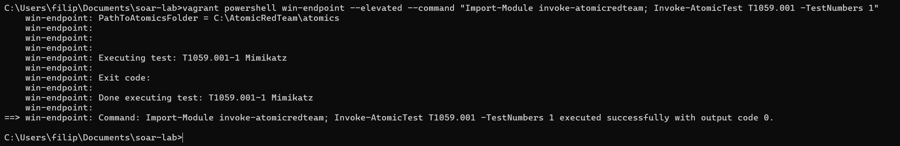
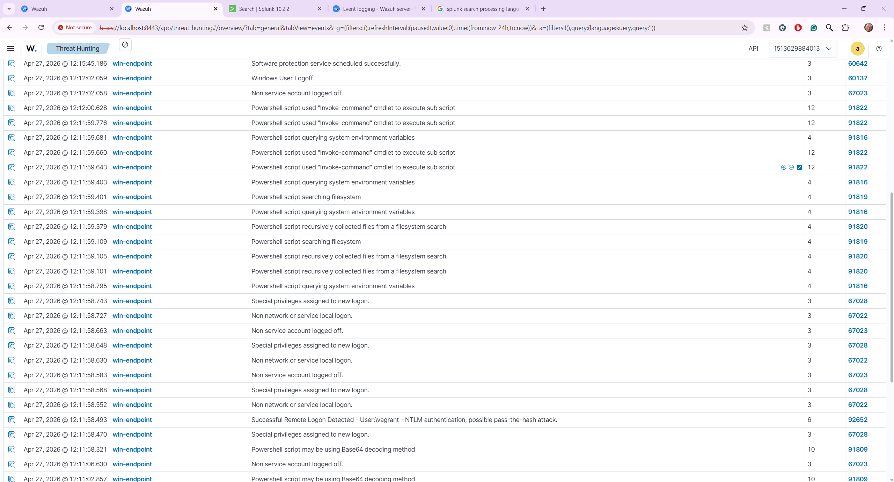
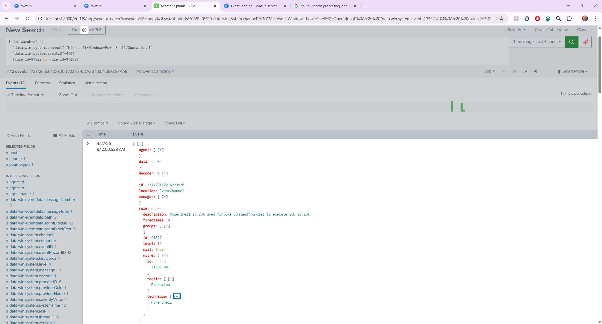

# soar-lab-security

**Phase 2 of the SOC Engineering Lab** — adversary simulation, detection engineering, SOAR automation, and incident response documentation.

> Infrastructure (Vagrant, Splunk, Wazuh, Shuffle) lives in [soar-lab](https://github.com/filipperichta/soar-lab). Portfolio site: [filipperichta.github.io](https://filipperichta.github.io).

---

## Overview

Each attack scenario follows the same lifecycle:

```
Atomic Red Team       Wazuh Agent          Splunk              Shuffle SOAR
(win-endpoint)  →  (Event ID 4104)  →  (wazuh-alerts)  →   Playbook triggered
                                             ↓
                                       SPL Detection              IR Report
                                        Rule fires              documented
```

---

## Lab Environment

| Component | Role | Details |
|---|---|---|
| `win-endpoint` | Target | Windows 11, Wazuh agent, ART installed |
| `soc-stack` | SOC VM | Splunk + Wazuh + Shuffle on Ubuntu |
| Atomic Red Team | Attack simulation | Invoke-AtomicRedTeam module |
| Wazuh | EDR / XDR | Script Block Logging, Event ID 4104 |
| Splunk | SIEM | wazuh-alerts index, custom SPL rules |
| Shuffle SOAR | Automation | Playbooks triggered by Splunk alerts |

---

## Attack Scenarios

### ✅ Scenario 1 — T1059.001: PowerShell Script Execution

| Field | Value |
|---|---|
| **Tactic** | Execution |
| **Technique** | T1059.001 — Command and Scripting Interpreter: PowerShell |
| **ATT&CK** | [attack.mitre.org/techniques/T1059/001](https://attack.mitre.org/techniques/T1059/001/) |
| **ART Test** | T1059.001-1 Mimikatz |
| **Wazuh Rule** | 91822 — level 12 |
| **Windows Event** | ID 4104 — Script Block Logging |
| **IR Report** | [ir-reports/T1059.001-powershell-execution.md](ir-reports/T1059.001-powershell-execution.md) |

#### What was simulated

Atomic Red Team test T1059.001-1 executed on the Windows 11 endpoint using `Invoke-Command` to run sub-scripts — simulating adversary PowerShell abuse commonly used to execute malicious payloads while evading basic process monitoring.

```powershell
Import-Module invoke-atomicredteam
Invoke-AtomicTest T1059.001 -TestNumbers 1
```

#### ART Execution



*Atomic Red Team T1059.001-1 Mimikatz executing successfully on win-endpoint via `vagrant powershell --elevated`*

#### Detection in Wazuh

Wazuh captured the full PowerShell script block via **Event ID 4104** and fired multiple rules within 2 seconds of execution:

| Rule ID | Description | Severity |
|---|---|---|
| **91822** | PowerShell script used "Invoke-command" cmdlet to execute sub script | **Level 12** |
| **91809** | PowerShell script may be using Base64 decoding method | **Level 10** |
| 91820 | PowerShell script recursively collected files from filesystem search | Level 4 |
| 91819 | PowerShell script searching filesystem | Level 4 |
| 91816 | PowerShell script querying system environment variables | Level 4 |



*Wazuh Threat Hunting — rule 91822 firing at severity level 12 on win-endpoint*

#### Detection in Splunk

Alert forwarded from Wazuh to Splunk via Universal Forwarder. Full `scriptBlockText` preserved in the event — complete visibility into what PowerShell code executed.



*Splunk wazuh-alerts index — Event ID 4104 with complete scriptBlockText captured*

#### SPL Detection Rule

```spl
index=wazuh-alerts
  "data.win.system.channel"="Microsoft-Windows-PowerShell/Operational"
  "data.win.system.eventID"=4104
  (rule.id=91822 OR rule.id=91809)
| eval technique="T1059.001"
| table _time, agent.name, rule.id, rule.description,
        rule.level, data.win.eventdata.scriptBlockText
| sort -_time
```

Full rule: [`splunk/detections/T1059.001-powershell-scriptblock.spl`](splunk/detections/T1059.001-powershell-scriptblock.spl)

---

### 🔲 Scenario 2 — T1003.001: LSASS Memory Dump

| Field | Value |
|---|---|
| **Tactic** | Credential Access |
| **Technique** | T1003.001 — OS Credential Dumping: LSASS Memory |
| **Status** | Planned |

---

### 🔲 Scenario 3 — T1547.001: Registry Run Keys

| Field | Value |
|---|---|
| **Tactic** | Persistence |
| **Technique** | T1547.001 — Boot or Logon Autostart Execution: Registry Run Keys |
| **Status** | Planned |

---

## Running Tests

```cmd
# Run a test (from soar-lab directory on host)
vagrant powershell win-endpoint --elevated --command "Import-Module invoke-atomicredteam; Invoke-AtomicTest T1059.001 -TestNumbers 1"

# Clean up after
vagrant powershell win-endpoint --elevated --command "Import-Module invoke-atomicredteam; Invoke-AtomicTest T1059.001 -TestNumbers 1 -Cleanup"
```

---

## Related

- [soar-lab](https://github.com/filipperichta/soar-lab) — Infrastructure repo
- [filipperichta.github.io](https://filipperichta.github.io) — Portfolio site with full writeups
