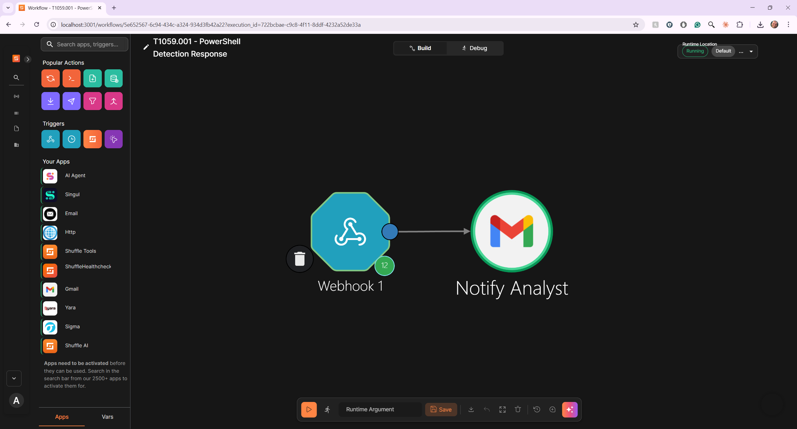
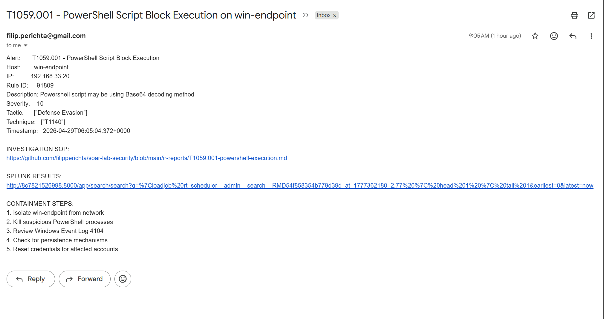

# soar-lab-security

Phase 2 of the SOC Engineering Lab — adversary simulation, detection engineering, SOAR automation, and incident response documentation.

Infrastructure (Vagrant, Splunk, Wazuh, Shuffle) lives in [soar-lab](https://github.com/filipperichta/soar-lab).  
Portfolio site: [filipperichta.github.io](https://filipperichta.github.io)

---

## Overview

Each attack scenario follows the same lifecycle:

```
Atomic Red Team    Wazuh Agent         Splunk              Shuffle SOAR
(win-endpoint)  →  (Event ID 4104)  →  (wazuh-alerts)  →  Playbook triggered
                                            ↓
                                       SPL Detection
                                       IR Report
                                       Rule fires
                                       documented
```

---

## Lab Environment

| Component | Role | Details |
|---|---|---|
| win-endpoint | Target | Windows 11, Wazuh agent, ART installed |
| soc-stack | SOC VM | Splunk + Wazuh + Shuffle on Ubuntu |
| Atomic Red Team | Attack simulation | Invoke-AtomicRedTeam module |
| Wazuh | EDR / XDR | Script Block Logging, Event ID 4104 |
| Splunk | SIEM | wazuh-alerts index, custom SPL rules |
| Shuffle | SOAR | Automation playbooks triggered by Splunk alerts |

---

## Attack Scenarios

### ✅ Scenario 1 — T1059.001: PowerShell Script Execution

| Field | Value |
|---|---|
| Tactic | Execution |
| Technique | T1059.001 — Command and Scripting Interpreter: PowerShell |
| ATT&CK | [attack.mitre.org/techniques/T1059/001](https://attack.mitre.org/techniques/T1059/001) |
| ART Test | T1059.001-1 Mimikatz |
| Wazuh Rule | 91822 — level 12 |
| Windows Event ID | 4104 — Script Block Logging |
| IR Report | [ir-reports/T1059.001-powershell-execution.md](ir-reports/T1059.001-powershell-execution.md) |

**What was simulated**

Atomic Red Team test T1059.001-1 executed on the Windows 11 endpoint using Invoke-Command to run sub-scripts — simulating adversary PowerShell abuse commonly used to execute malicious payloads while evading basic process monitoring.

```powershell
Import-Module invoke-atomicredteam
Invoke-AtomicTest T1059.001 -TestNumbers 1
```


*Atomic Red Team T1059.001-1 executing successfully on win-endpoint via `vagrant powershell --elevated`*

---

**Detection in Wazuh**

Wazuh captured the full PowerShell script block via Event ID 4104 and fired multiple rules within 2 seconds of execution:

| Rule ID | Description | Severity |
|---|---|---|
| 91822 | PowerShell script used "Invoke-command" cmdlet to execute sub script | Level 12 |
| 91809 | PowerShell script may be using Base64 decoding method | Level 10 |
| 91820 | PowerShell script recursively collected files from filesystem search | Level 4 |
| 91819 | PowerShell script searching filesystem | Level 4 |
| 91816 | PowerShell script querying system environment variables | Level 4 |


*Wazuh Threat Hunting — rule 91822 firing at severity level 12 on win-endpoint*

---

**Detection in Splunk**

Alert forwarded from Wazuh to Splunk via Universal Forwarder. Full `scriptBlockText` preserved in the event — complete visibility into what PowerShell code executed.


*Splunk wazuh-alerts index — Event ID 4104 with complete scriptBlockText captured*

**SPL Detection Rule**

```spl
index=wazuh-alerts
    "data.win.system.channel"="Microsoft-Windows-PowerShell/Operational"
    "data.win.system.eventID"=4104
    (rule.id=91822 OR rule.id=91809)
| eval technique="T1059.001"
| eval tactic="Execution"
| table _time, agent.name, agent.ip, rule.id, rule.description,
        rule.level, data.win.eventdata.scriptBlockText, technique, tactic
| sort -_time
```

Full rule: [`splunk/detections/T1059.001-powershell-scriptblock.spl`](splunk/detections/T1059.001-powershell-scriptblock.spl)

---

**Shuffle SOAR Playbook**

Splunk real-time alert fires a webhook to Shuffle, which automatically notifies the analyst via email within seconds of detection.


*Shuffle SOAR — Webhook trigger (Splunk alert) → Gmail analyst notification*

| Field | Value |
|---|---|
| Workflow name | `T1059.001 - PowerShell Detection Response` |
| Trigger | Splunk real-time alert → webhook, throttled 60 seconds per host |
| Action | Gmail `Send mail` — analyst email notification |
| Workflow file | [`shuffle/workflows/T1059.001-powershell-detection-response.json`](shuffle/workflows/T1059.001-powershell-detection-response.json) |

**Email alert contains:**
- Alert name, hostname, IP address
- Rule ID, severity level, MITRE tactic & technique
- Link to IR report on GitHub
- Immediate containment steps

**Subject:**
```
$exec.search_name detected on $exec.result._raw.agent.name
```

**Body:**
```
SECURITY ALERT — SOC Lab Detection
====================================
Alert:       $exec.search_name
Host:        $exec.result.agent.name
IP:          $exec.result.agent.ip
Rule ID:     $exec.result.rule.id
Description: $exec.result.rule.description
Severity:    $exec.result.rule.level
Tactic:      $exec.result.rule.mitre.tactic
Technique:   $exec.result.rule.mitre.id
Timestamp:   $exec.result.timestamp

INVESTIGATION SOP:
https://github.com/filipperichta/soar-lab-security/blob/main/ir-reports/T1059.001-powershell-execution.md

SPLUNK RESULTS:
$exec.results_link

CONTAINMENT STEPS:
1. Isolate win-endpoint from network
2. Kill suspicious PowerShell processes
3. Review Windows Event Log 4104
4. Check for persistence mechanisms
5. Reset credentials for affected accounts
```


*Gmail analyst notification — triggered within seconds of Splunk alert firing*

---

### 🔲 Scenario 2 — T1547.001: Registry Run Keys

| Field | Value |
|---|---|
| Tactic | Persistence |
| Technique | T1547.001 — Boot or Logon Autostart Execution: Registry Run Keys |
| ATT&CK | [attack.mitre.org/techniques/T1547/001](https://attack.mitre.org/techniques/T1547/001) |
| Status | Planned |

---

### 🔲 Scenario 3 — T1003.001: LSASS Memory Dump

| Field | Value |
|---|---|
| Tactic | Credential Access |
| Technique | T1003.001 — OS Credential Dumping: LSASS Memory |
| ATT&CK | [attack.mitre.org/techniques/T1003/001](https://attack.mitre.org/techniques/T1003/001) |
| Status | Planned |

---

## Running Tests

```bash
# Run a test (from soar-lab directory on host)
vagrant powershell win-endpoint --elevated --command "Import-Module invoke-atomicredteam; Invoke-AtomicTest T1059.001 -TestNumbers 1"

# Clean up after
vagrant powershell win-endpoint --elevated --command "Import-Module invoke-atomicredteam; Invoke-AtomicTest T1059.001 -TestNumbers 1 -Cleanup"
```

---

## Related

- [soar-lab](https://github.com/filipperichta/soar-lab) — Infrastructure repo
- [filipperichta.github.io](https://filipperichta.github.io) — Portfolio site with full writeups
